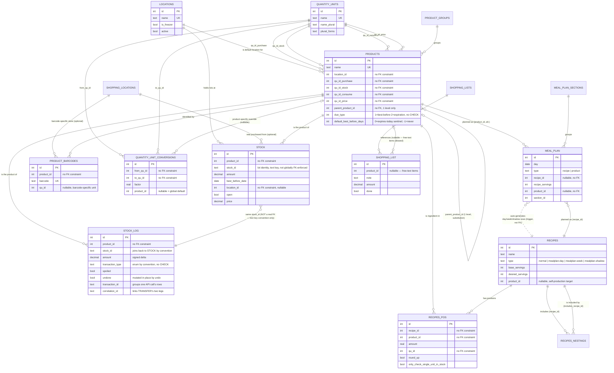

# Grocy research: API, database, migrations, tests (tasks.md 3.21–3.24) + database archaeology

Continuation of `grocy-inventory-and-stock.md` and `grocy-units-and-planning.md` — same live
instance (`192.168.1.183`, Grocy 4.6.0, LinuxServer image, `db_version` 255), same methodology.
This document additionally performs `tasks.md` §5 (Phase 2 — Database Archaeology) for Grocy,
using `migrations/*.sql` sparse-checked-out from `https://github.com/grocy/grocy` (256 files,
`0001.sql`…`0255.sql` plus `8888.php`) alongside direct `sqlite3 .schema`/`PRAGMA` introspection
of the live database.

---

## 3.21 API

**User behavior.** Every UI action in Grocy is itself a call to this same REST API — there is no
separate internal interface; `public/viewjs/*.js` calls the identical `/api/*` endpoints this
research called directly with `curl`.

**Authentication.** Two mechanisms, both discovered by reading `middleware/ApiKeyAuthMiddleware.php`
and `services/ApiKeyService.php` directly:

1. **Session cookie**, established via `POST /login` (form fields `username`/`password`/
   `stay_logged_in`, confirmed from `views/login.blade.php`'s form markup — not `user`/`password`
   as commonly guessed). **This route did not work cleanly against this specific LinuxServer
   deployment** during this research — `POST /login` with correct field names and a plausible
   `admin`/`admin` credential pair returned an HTTP 500 ("Method not allowed. Must be one of:
   GET" from Slim's `RoutingMiddleware`, on the *redirect target* after the POST, not the login
   route itself) rather than a working session; the LinuxServer image's actual seeded password is
   a bcrypt hash, not necessarily `admin` (`SELECT password FROM users` shows `$2y$12$...`), so
   the credential itself may simply have been wrong rather than the route being broken — this was
   not fully root-caused.
2. **API key**, sent as the `GROCY-API-KEY` header (or, "not recommended" per the source
   comment, as a same-named query parameter) — generated normally via the UI's
   Settings → API keys screen (itself just `POST` to a users-authenticated endpoint), which
   requires the session-cookie flow above to reach in the first place.

**This research's actual access method** (undocumented anywhere in Grocy's own docs, but fully
legitimate given direct SQLite access to the isolated research instance): inserted a row directly
into `api_keys(api_key, user_id, expires, key_type, description)` via `sqlite3`, with `expires`
set explicitly to a far-future date (the default `INSERT` left `expires` NULL, which
`ApiKeyService::IsValidApiKey`'s `WHERE ... AND expires > :now` correctly treats as "already
expired" — confirmed by a first `401` before setting `expires`). Every API call in this and the
two companion documents used
`curl -H "GROCY-API-KEY: <key>" http://192.168.1.183/api/...`.

**API shape.** Two families, confirmed against the live `GET /api/openapi/specification` (73
paths):

- **Generic entity CRUD**: `GET/POST /api/objects/{entity}`, `GET/PUT/DELETE
  /api/objects/{entity}/{id}` — works against *any* table or view LessQL (Grocy's lightweight
  DB-access layer) can see, including read-only computed views (`quantity_unit_conversions_resolved`,
  `stock_current`, etc. — writes to those simply fail at the DB layer, there is no
  separate read-only/writable distinction enforced at the API layer itself). This is how all
  reference/master data (locations, quantity units, products, barcodes, recipes, recipe
  positions, meal plan entries) was created in this research.
- **Verb-shaped domain endpoints**: `/api/stock/products/{id}/{add|consume|transfer|inventory|
  open}` and their `by-barcode` equivalents (§3.8–3.13 of `grocy-inventory-and-stock.md`),
  `/api/recipes/{id}/{fulfillment|consume|copy}`, `/api/stock/shoppinglist/*`. These are the
  only endpoints with real business logic (default-date computation, FEFO/FIFO lot walking, unit
  resolution) — the generic CRUD endpoints are pure passthrough to the underlying table/trigger
  behavior.

**Error handling.** Domain-endpoint failures return `400` with `{"error_message": "..."}` (plain
English, meant for direct display — e.g. `"Amount to be consumed cannot be > current stock
amount"`, `"No product with barcode ... found"`) — not a structured/machine-parseable error code.
Malformed requests (bad Content-Type on an otherwise-empty POST body, confirmed live against
`/api/recipes/{id}/add-not-fulfilled-products-to-shoppinglist`) surface as raw PHP stack traces
in the response body by default (`GenericErrorResponse` catches domain exceptions cleanly, but
routing-level Slim exceptions do not go through it).

**Tests.** None — no API integration test suite exists in the repository (see §3.24).

**Strengths.** The generic-CRUD-plus-verb-endpoints split is pragmatic and genuinely reduces
boilerplate: master/reference data gets full CRUD for free from one mechanism, while the
handful of operations with real invariants (stock mutation, recipe consumption) get hand-written
validation. `GROCY-API-KEY` header auth with per-key `expires`/`key_type`/`description` and a
`last_used` timestamp (updated on every valid use, confirmed in `IsValidApiKey`) is simple and
auditable.

**Weaknesses.** The generic CRUD endpoint exposing *views* as if they were writable resources
(distinguishable from real tables only by attempting a write and reading the resulting SQL
error) is a real API-design smell — nothing in `/api/objects/{entity}`'s shape or the OpenAPI
spec's schema for it marks an entity read-only. Plain-English `error_message` strings as the
only error signal make programmatic error handling (retry vs. surface-to-user vs. fatal) require
string matching. The stock-write endpoints' unit-ambiguity (`grocy-inventory-and-stock.md` §3.8)
is itself partly an API-design weakness, not just a documentation gap.

**Spisordning lesson.** The generic-CRUD-for-reference-data / hand-written-endpoints-for-
invariant-bearing-operations split is worth adopting as a *pattern*, though Spisordning's actual
mechanism should differ: `PLAN.md`'s Directus Research Spike section's `SAFE_DIRECT_CRUD` /
`READ_ONLY` / `DOMAIN_CONTROLLED` / `HIDDEN` classification is a strictly better version of the
same idea — Grocy's "generic CRUD over anything LessQL can see, writability discovered by
failure" is precisely the un-classified, no-declared-boundary version PLAN.md's Directus
classification exists to avoid. Structured, typed API errors (an error `code`, not just an
`error_message` string) are a small but real improvement Spisordning's own OpenAPI-first REST
layer should make over Grocy's reference behavior.

---

## 3.22 Database

**Engine.** SQLite (single file, `/config/data/grocy.db` on this deployment), confirmed via
`GET /api/system/info` → `"sqlite_version":"3.51.2"`. This is a **single-tenant, single-file,
embedded-database design end to end** — there is no household/tenant scoping column anywhere in
the schema (confirmed absent from `locations`, `products`, `stock`, `recipes`, `shopping_lists`)
because Grocy fundamentally assumes one household per deployment/database file.

**Scale.** 38 tables, 45 views, 55 triggers (`SELECT count(*) FROM sqlite_master WHERE
type='...'`, run live). **More views than tables** is itself a strong architectural signal,
confirmed throughout `grocy-units-and-planning.md`'s §3.15/§3.18/§3.20: real business logic
(unit-conversion closure resolution, recipe fulfillment/cost/calorie computation, current/average
price, FEFO/FIFO lot ordering) is implemented in SQL views, not application code — a genuinely
unusual architectural choice for a PHP application, and a double-edged one (see Weaknesses
below).

**Foreign keys — the single most important database-archaeology finding.**
`PRAGMA foreign_keys` on the live database returns `0` (disabled), and `PRAGMA
foreign_key_list(<table>)` returns **empty for every table checked** (`stock`, `products`,
`recipes_pos`, and by extension the rest — none of the `.schema` output captured across both
companion documents contains a single `REFERENCES` or `FOREIGN KEY` clause). **Grocy has zero
declared foreign-key constraints anywhere in its schema.** Referential integrity is instead
enforced entirely, and inconsistently, via hand-written triggers:

- Some relationships get an explicit existence-check trigger (e.g.
  `prevent_adding_barcodes_for_not_existing_products` on `product_barcodes.product_id`).
- Others get no check at all at the database layer — `stock.product_id`, `stock_log.product_id`,
  `recipes_pos.product_id`, `meal_plan.recipe_id`/`product_id` all have no corresponding
  existence-enforcing trigger found in this research's schema review; correctness there depends
  entirely on `services/*.php` validating before writing (e.g. `ProductExists()` checks scattered
  through `StockService.php`), which is exactly the "hope the application layer always remembers"
  failure mode real foreign keys exist to eliminate.
- Cascading behavior is hand-rolled per relationship rather than declared once: `products`' own
  `cascade_product_removal` trigger (`grocy-inventory-and-stock.md` §3.1) manually deletes rows
  from `stock`, `stock_log`, `product_barcodes`, `quantity_unit_conversions`, `recipes_pos`,
  `meal_plan`, `shopping_list`, and `userfield_values`, and nulls `recipes.product_id` — nine
  separate hand-maintained cascade/null-out steps a real `ON DELETE CASCADE`/`ON DELETE SET
  NULL` FK declaration would express declaratively and enforce automatically, with no risk of a
  tenth related table being added later and the cascade trigger simply not being updated to
  match.

**Uniqueness.** Real `UNIQUE` constraints exist and are used correctly where SQLite's semantics
suffice (`products.name`, `locations.name`, `quantity_units.name`, `product_barcodes.barcode`
via a `UNIQUE INDEX`). Where a uniqueness rule needs to treat `NULL` as a real, comparable value
(SQL `UNIQUE` never does — two `NULL`s are never "duplicates" under standard SQL semantics),
Grocy falls back to the same hand-rolled-trigger pattern: `quantity_unit_conversions`' "no
duplicate `(from_qu_id, to_qu_id, product_id)` including when `product_id IS NULL`" rule
(`grocy-units-and-planning.md` §3.15/§3.16) is enforced by a `BEFORE INSERT`/`BEFORE UPDATE`
trigger pair doing `IFNULL(product_id, 0) = IFNULL(NEW.product_id, 0)` comparisons — a real,
correct, but verbose workaround for a genuine SQLite/SQL-standard limitation.

**Quantity representation.** `DECIMAL(15,2)` for `stock.amount`/`stock_log.amount`/`price`
(SQLite has no true fixed-point decimal type — this is a type *affinity* hint only; SQLite
stores it as REAL underneath). No integer-cents convention for money (`grocy-units-and-planning.md`
§3.20's `costs: 7580` for what is actually 75.80 currency units, confirmed by the recipe's known
ingredient prices, not integer cents as the round number might suggest).

**Audit/history structures.** No single unified audit table — history is distributed across
purpose-specific mechanisms: `stock_log` (inventory transaction history, §3.5 of the companion
doc), `stock_edited_entries` (a *view*, not a table, deriving which lots were manually corrected
by pattern-matching `stock-edit-old`/`stock-edit-new` transaction-type pairs in `stock_log`
itself), and nothing at all for most other tables (`products`, `locations`, `recipes` have a
`row_created_timestamp` but no update history — editing a product's name leaves no trace of
what it used to be called).

**Source implementation.** `.schema`/`PRAGMA` output from the live database throughout; the
absence of FK declarations confirmed by grepping `.schema` output for `REFERENCES`/`FOREIGN KEY`
across every table this research inspected (zero matches).

**Tests.** None (§3.24).

**Strengths.** Trigger-based cascade/validation logic, while it forfeits declarative FK
guarantees, *is* real, working, and battle-tested — this is not a toy schema, it is running in
production for a large user base and clearly functions. Deliberate use of type affinity
(`DECIMAL(15,2)`) as documentation-via-schema of intent, even where SQLite won't enforce it, is a
reasonable low-cost signal.

**Weaknesses.** The zero-FK, all-triggers approach is the single clearest anti-pattern this
entire research surfaced, and it is directly, explicitly what `establish-household-and-catalog`/
`implement-pantry-inventory`'s design.md documents already commit to avoiding — but Grocy is
concrete, lived proof of the actual failure mode, not a hypothetical: inconsistent enforcement
(some relationships checked, some not), cascade logic that must be manually kept in sync with
schema changes rather than being declared once, and no way to ask the database itself "what
references this row" (a real FK-aware tool can answer that instantly; Grocy's trigger-based
approach requires grepping `.schema` output for the pattern, exactly as this research had to do).
The lack of any unified audit/versioning structure beyond ad hoc per-table conventions
(`stock_log` for stock, nothing for most else) means "what did this product used to be called"
is simply unanswerable for the majority of tables.

**Spisordning lesson.** This is the strongest, most concrete validation in the whole
investigation for `PLAN.md`'s "Do Not Use Generic Polymorphism Carelessly... Prefer real
relational relationships" and its Database Review Questions' "Can the relationship be represented
with a real FK?" — Grocy chose the trigger-emulation path (arguably *because* SQLite makes real
FK enforcement opt-in and easy to leave off, `PRAGMA foreign_keys` defaulting to disabled unless
a connection explicitly turns it on), and the result is exactly the kind of "hope the application
layer remembers" fragility a Postgres-with-real-FKs choice (already made for Spisordning)
structurally avoids. Every `establish-household-and-catalog`/`implement-pantry-inventory` design
decision to use concrete typed FK columns (rather than `entity_type`/`entity_id`) is directly
reinforced, not just by principle but by a working counter-example of what the alternative costs
in practice over years of accretion (nine hand-maintained cascade steps on `products` alone).

---

## 3.23 Migrations

**Mechanism.** `services/DatabaseMigrationService::MigrateDatabase()` (read in full from the live
container) — run automatically on application boot, not as a separate CLI/CI step. It lists every
file in `migrations/`, sorts by filename, and for each `NNNN.sql`/`NNNN.php` checks a
`migrations(migration INTEGER PRIMARY KEY, execution_time_timestamp)` tracking table; if the
numeric id (leading zeros stripped) is not yet present, it applies the migration and records it.
**SQL migrations are wrapped in an explicit `beginTransaction()`/`commit()`/`rollback()`** — a
real transactional-migration guarantee **PHP migrations do not get** (no transaction wrapping
visible around the `include $phpFile` call), a real asymmetry in the migration runner's own
safety guarantees. Two numeric sentinels are hard-coded as permanently-always-rerun: `8888`
(`DOALWAYS_MIGRATION_ID` — used for idempotent checks that should run every boot) and `9999`
(`EMERGENCY_MIGRATION_ID` — an explicit "manual fix, never shipped, always executes" escape
hatch, confirmed live: `8888.php` exists in the fetched migration file list). A `VACUUM` runs
once at the end if any migration actually applied.

**Migration history (Phase 2 archaeology — problematic schemas migrated away from).**
256 migration files (`0001.sql` → `0255.sql`, plus `8888.php`), fetched via a sparse
`git clone --filter=blob:none --sparse` of `github.com/grocy/grocy` scoped to `migrations/`.
Two concrete, well-evidenced examples of exactly what `tasks.md` §5 asks for:

1. **A single `barcode TEXT` column on `products`, abused to hold multiple comma-separated
   values, replaced by a real one-to-many `product_barcodes` table.** `migrations/0001.sql`
   (the very first migration) declares `products` with a bare `barcode TEXT` column — one
   barcode slot per product. `migrations/0103.sql` (roughly 40% of the way through the project's
   migration history) performs the fix, and its own migration SQL proves the interim abuse
   directly: the data-migration step is a **recursive CTE that splits `products.barcode` on
   commas** (`WITH barcodes_splitted(...) AS (SELECT id, '', barcode || ',', ... UNION ALL SELECT
   ..., SUBSTR(str, 0, instr(str, ',')), ...)`) into individual rows of the new
   `product_barcodes` table — meaning, in production, before this migration, a product with
   multiple barcodes had them jammed into one text column as a comma-separated list, the classic
   first-normal-form violation, silently working (string matching on a scan) until someone
   needed to query "which products have barcode X" properly. The migration also demonstrates
   SQLite's historical `ALTER TABLE` limitations forcing a `RENAME TO products_old` → `CREATE
   TABLE products (new shape)` → `INSERT ... SELECT` → `DROP TABLE products_old` dance rather
   than a simple `ALTER TABLE ... DROP COLUMN` (also present in `PRAGMA legacy_alter_table = ON`
   in the same file) — a real SQLite-specific migration-cost lesson, less relevant to
   Spisordning's Postgres target but a useful reminder that DB-engine constraints shape migration
   *strategy*, not just schema.
2. **A single flat `qu_factor_purchase_to_stock REAL` column on `products`, replaced by the full
   `quantity_unit_conversions` graph-with-recursive-closure system.** `migrations/0001.sql`'s
   original `products` table has `qu_factor_purchase_to_stock REAL NOT NULL` — one static
   purchase→stock ratio per product, no product-specific overrides for *other* unit pairs
   (consume, price), no global/default conversion graph, no multi-hop resolution. Introduced
   incrementally starting at `migrations/0082.sql` (`CREATE TABLE quantity_unit_conversions`,
   with `quantity_unit_conversions_resolved` initially defined as three explicit `UNION`ed
   `SELECT`s — product's own flat factor, product-specific overrides, and global defaults — a
   simpler, non-recursive precursor to the recursive-CTE closure documented live in
   `grocy-units-and-planning.md` §3.15), the flat column persisted **alongside** the new table
   for many subsequent migrations (confirmed: `qu_factor_purchase_to_stock` still referenced in
   `quantity_unit_conversions_resolved`'s view definition as late as `migrations/0126.sql`)
   before eventually being fully retired in favor of the graph-based system exclusively — the
   exact evolution `grocy-units-and-planning.md` §3.15's "Spisordning lesson" already draws on.
   This research did not pin down the exact migration number of the flat column's final removal
   (not essential to the finding — the live schema confirms it is gone, and the multi-migration
   overlap window itself is the interesting archaeological fact: Grocy ran *both* systems
   simultaneously for a stretch rather than a single atomic cutover).

**Source implementation.** `services/DatabaseMigrationService.php` (fully quoted above);
`migrations/0001.sql`, `migrations/0082.sql`, `migrations/0103.sql`, `migrations/0126.sql` from
GitHub.

**Tests.** None — no migration test harness exists (no way to verify a migration applies
cleanly to a range of historical schema states short of manually running the whole chain, which
the application itself does on every fresh boot as its only implicit "test").

**Strengths.** Filename-ordered, tracked-by-integer-id, idempotent-by-a-tracking-table migrations
are a solid, standard baseline. The `8888`/`9999` sentinel-id escape hatches for "run this every
boot regardless" and "manual emergency fix" are a pragmatic, honestly-named pattern worth noting
even if Spisordning's own migration tooling (likely a standard Go migration library) won't need
the exact mechanism.

**Weaknesses.** No dry-run, no down-migrations/rollback path beyond the automatic pre-update
`.tgz` backup `update.sh` takes (a whole-application-directory backup, not a schema-level
rollback), and the SQL-transactional/PHP-non-transactional asymmetry is a real, avoidable gap —
a failing PHP migration mid-execution has no rollback guarantee at all. The multi-migration
overlap windows (old and new schema-for-the-same-concept coexisting across dozens of migrations)
observed in the unit-conversion example suggest Grocy's migrations are not always atomic
cutovers, which is realistic for a long-lived project but adds real complexity to reasoning about
"what does migration N assume already exists."

**Spisordning lesson.** Both concrete archaeology examples validate specific, already-made
Spisordning decisions rather than surfacing new ones: the barcode-column history directly
validates `establish-household-and-catalog`'s `product_identifier` table (already a real
one-to-many table, never a single column) and the unit-conversion history directly validates
`grocy-units-and-planning.md`'s recommendation to adopt Grocy's *current* two-tier
global/product-specific conversion graph rather than a flat per-product factor — Spisordning
should treat both of Grocy's "problematic schema" examples as decided, not as open questions to
re-litigate. The transactional-SQL/non-transactional-PHP migration-runner asymmetry is worth
avoiding outright in Spisordning's own migration tooling: every migration, regardless of how it's
authored, should run inside a real transaction with automatic rollback on failure.

---

## 3.24 Tests

**Finding.** Grocy has **no automated test suite of any kind.** Confirmed by three independent
checks against `https://github.com/grocy/grocy`:

1. No `tests/` directory (or any similarly-named directory) exists at the repository root —
   `gh api repos/grocy/grocy/contents` lists `.devtools`, `.github`, `.gitattributes`,
   `.gitignore`, `.tx`, `.vscode`, `.yarnrc`, `LICENSE.md`, `README.md`, `app.php`, `changelog`,
   `composer.json`, `composer.lock`, `config-dist.php`, `controllers`, `data`, `docs`,
   `grocy.openapi.json`, `helpers`, `localization`, `middleware`, `migrations`, `package.json`,
   `plugins`, `public`, `routes.php`, `services`, `update.sh`, `version.json`, `views`,
   `yarn.lock` — no test directory among them.
2. No CI test workflow exists — `gh api repos/grocy/grocy/contents/.github/workflows` returns a
   `404 Not Found`; `.github/` itself contains only `CONTRIBUTING.md`, `FUNDING.yml`,
   `ISSUE_TEMPLATE/`, `PULL_REQUEST_TEMPLATE.md`, `SECURITY.md`, `publication_assets/` — no
   `workflows/` directory at all, meaning **there is no GitHub Actions test run on any PR or
   push**.
3. No test framework dependency — `composer.json`'s `require-dev` section is empty (confirmed by
   parsing the file directly); no PHPUnit, no Pest, nothing.

**What substitutes for tests, in practice.** `DatabaseMigrationService::MigrateDatabase()`
running the full migration chain on every application boot is, in effect, the only thing
resembling an automated correctness check the project has — if a migration is malformed, a fresh
container fails to start, which this research's own deployment implicitly exercised
successfully (Grocy 4.6.0 booted cleanly against 255 sequential migrations). Everything else —
correct FEFO/FIFO ordering, correct unit-conversion closure resolution, correct recipe
fulfillment math, correct undo behavior — has no test coverage whatsoever and is only verified,
if at all, by manual QA and the community's real-world usage surfacing bugs as GitHub issues
after the fact.

**Strengths.** None to report honestly — this is not a strength of the reference system.

**Weaknesses.** Given the density and subtlety of business logic this research documented living
in triggers and ~100-line recursive SQL views (`quantity_unit_conversions_resolved`,
`recipes_pos_resolved`, the meal-plan shadow-recipe trigger machinery), the complete absence of
automated tests is a genuinely significant risk surface for a project of Grocy's age, user base,
and financial-data-adjacent purpose (people track grocery spending and inventory value through
it). Several of the edge cases this research surfaced live — the OPEN-split identity asymmetry
vs. CONSUME-split identity preservation (`grocy-inventory-and-stock.md` §3.6), the meal-plan
shadow-recipe serving-count trap (`grocy-units-and-planning.md` §3.19), the silent 1:1
product-specific-conversion auto-insert (`grocy-units-and-planning.md` §3.16) — are exactly the
class of regression a table-driven unit-test suite over `StockService`/`RecipesService` would
have caught and pinned down permanently. None of them are.

**Spisordning lesson.** This is unambiguous, first-party validation of `PLAN.md`'s own Testing
section and `establish-reference-lab`'s explicit mandate to build "reference-behavior tests for
useful edge cases" when reimplementing semantics learned from Grocy — Grocy is the clearest
possible illustration of *why* that mandate exists, not just an abstract best practice. Every
concrete edge case this research pinned down with a live `curl` call and a SQLite read-back
(FEFO/FIFO priority order, the four independent unit-conversion auto-insert triggers, the ADJUST-
equals-current-amount rejection, the undo-mutates-history behavior, the meal-plan shadow-recipe
serving mismatch) is a direct, ready-made candidate for a Spisordning domain unit test — assert
the *behavior Spisordning chooses to keep* (e.g. FEFO/FIFO lot ordering, product-specific
conversion requiring explicit confirmation) and explicitly assert against the behavior it
deliberately diverges from (e.g. undo-as-mutation, DISCARD/MARK_EMPTY collapsed into a boolean
flag) so a future change can't silently regress toward Grocy's shortcuts without a test failing
first.

---

## Database archaeology: full findings and ER diagram

### Tables (product/stock/location/lot/unit portion — auth/session/UI-config tables excluded per
scope)

| Table | Row = | Notable columns | FK reality |
|---|---|---|---|
| `products` | one generic-or-branded food item (no Ingredient/Product split) | 46 columns; four independent unit roles (`qu_id_purchase/stock/consume/price`); `parent_product_id` (1-level-only substitution/aggregation); tare-weight, freeze/thaw, label-printer, calorie fields all first-class | none declared; `location_id`/`product_group_id`/`shopping_location_id`/`parent_product_id`/`qu_id_*` are bare `INTEGER` columns, checked (inconsistently) by triggers |
| `product_barcodes` | one barcode → one product (many-to-one) | `barcode` `UNIQUE INDEX`; optional `qu_id`/`amount` (barcode-specific multipack size) | `product_id` existence checked by trigger, not FK |
| `product_groups` | a category/grouping label | trivial | none declared |
| `locations` | a physical place | `is_freezer` (drives expiry recalculation on transfer) | none declared |
| `shopping_locations` | a *store*, not a place inventory sits (confusingly named relative to `locations`) | trivial | none declared |
| `quantity_units` | a unit of measure | `plural_forms` (locale-aware pluralization) | none declared |
| `quantity_unit_conversions` | one directed conversion edge, global (`product_id` NULL) or product-specific | auto-generates its own mathematical inverse via `AFTER INSERT`/`AFTER UPDATE` triggers | `from_qu_id`/`to_qu_id`/`product_id` bare `INTEGER`, no FK |
| `stock` | **one physical lot** — the mutable current-state row, deleted at zero | `stock_id` (a text UUID-ish key, stable identity *within* a lot's lifetime, not across splits — see companion doc §3.6); `open`/`opened_date`; `location_id` nullable (defaults from product) | none declared |
| `stock_log` | one signed delta transaction against a lot | `transaction_type` enum-by-convention (9 string values, no CHECK constraint); `undone`/`undone_timestamp` (mutated in place by undo, not append-only in practice — see companion doc §3.5); `transaction_id`/`correlation_id` (grouping, not FK-enforced) | none declared |
| `recipes` | a recipe **or** an internal bookkeeping pseudo-recipe, disambiguated only by `type` | `type IN ('normal','mealplan-day','mealplan-week','mealplan-shadow')` (not a real CHECK — enforced by convention); negative `id`s for synthetic rows | none declared |
| `recipes_pos` | one recipe ingredient line | `only_check_single_unit_in_stock`, `not_check_stock_fulfillment`, `round_up` (fulfillment-computation escape hatches) | none declared |
| `recipes_nestings` | one recipe-includes-recipe edge | `UNIQUE(recipe_id, includes_recipe_id)`; cycle-prevented by trigger, not by the constraint itself | none declared |
| `meal_plan` | one planned (day, recipe-or-product, quantity) entry | inserting one auto-creates 3 synthetic `recipes` rows (day/week/shadow) via trigger | none declared |
| `meal_plan_sections` | a named grouping (breakfast/lunch/dinner) | `id = -1` is a protected, undeletable default section | none declared |
| `shopping_lists` | one named list (usually just one, "Shopping list") | trivial | none declared |
| `shopping_list` | one line on a list | `product_id` **nullable** (free-text items, deliberately) | none declared |
| `users` | one login identity | referenced by `stock_log.user_id` (who performed the transaction) | none declared |
| `api_keys` | one API credential | `expires`, `key_type`, `last_used` | `user_id` bare `INTEGER`, no FK |

**Deletion behavior**, observed directly rather than just read from schema: deleting a `products`
row cascades through nine separate hand-written `DELETE`/`UPDATE` statements in one trigger
(`cascade_product_removal`) rather than a declared `ON DELETE` policy (see §3.22). A `stock` row
is deleted outright — not soft-deleted, not archived — the instant its `amount` reaches zero
(live-confirmed, `grocy-inventory-and-stock.md` §3.4); its full history survives only in
`stock_log`, joined back by the shared (but not FK-enforced) `stock_id` text key.

### Mermaid ER diagram — product/stock/location/lot/unit portion

**Reading note on the diagram's crow's-foot notation**: every relationship drawn above is the
*conceptual* cardinality Grocy's application code and triggers maintain — none of them is an
actual declared foreign key in the live schema (per the §3.22 finding). The diagram intentionally
annotates columns with `"no FK constraint"` rather than omitting that fact, since the absence of
real FKs is itself the headline archaeological finding for this portion of the schema, not an
incidental detail to smooth over.

---

## Cross-check against `PLAN.md` Phase 3 domain-model candidates

Per `tasks.md` §6.4, direct assessment of which PLAN.md candidates this Grocy research
**supports**, **contradicts**, or **leaves open**:

- **Pantry** (`inventory_locations`/`inventory_lots`/`inventory_events`, not
  `products.current_quantity`) — **strongly supported**. Grocy's own `stock` table is provably
  insufficient alone (lots vanish at zero); `stock_log` as a parallel, non-transactionally-
  guaranteed ledger is exactly the failure mode `implement-pantry-inventory`'s ledger-plus-
  projection design already anticipates and defends against more rigorously than Grocy itself
  does.
- **Inventory Events** vocabulary (`PURCHASE`/`CONSUME`/`DISCARD`/`ADJUST`/`TRANSFER`/
  `MARK_EMPTY`/`OPEN`) — **partially contradicted**. Grocy's real transaction-type vocabulary is
  narrower (`purchase`, `consume`, `inventory-correction`, `transfer_from`/`transfer_to`,
  `product-opened`, `stock-edit-old`/`stock-edit-new`, `self-production` — nine values, no
  `DISCARD` or `MARK_EMPTY`). See `grocy-inventory-and-stock.md` §3.10/§3.13 for the full
  argument: keep `DISCARD` distinct (Grocy's boolean flag is a real limitation worth improving
  on), but revisit whether `MARK_EMPTY` needs to be its own `kind` versus sugar over `CONSUME`
  with the full remaining quantity, since Grocy's own design treats it that way successfully.
- **Inventory Uncertainty** / confidence tiers — **left open by Grocy, not addressed either way**.
  Grocy has no confidence/uncertainty concept whatsoever — every quantity is treated as exactly
  known, always. This is itself a finding (see the standalone summary delivered alongside this
  document set): `implement-pantry-inventory` design.md's D3 combination-approach
  (confidence on the lot, justified per-event) has no Grocy precedent to validate *or* contradict
  it — it is genuinely new ground PLAN.md's own reference systems don't cover, which raises
  rather than lowers the bar for getting it right without reference-system guardrails.
- **Barcode** (lookup key, never identity; GTIN normalization; Open Food Facts; retailer
  fallback; manual entry) — **supported**, with a concrete gap-to-fill: Grocy's resolution chain
  matches the shape design.md D6 already specifies, but Grocy's actual Open Food Facts usage is
  far thinner (name + image only) than PLAN.md's own aspiration for that integration
  (ingredients/allergens/nutrition/categories) — Spisordning should not assume Grocy's plugin
  is a complete OFF integration to imitate.
- **Unit System** (universal dimensions distinct from ingredient-specific conversions; no
  universally-invented density values) — **strongly supported**. Grocy's two-tier global/
  product-specific `quantity_unit_conversions` graph, arrived at only after migrating away from a
  flat per-product factor (§3.23), is close to exactly what PLAN.md asks for, and its
  auto-insert-1:1-stub footgun (§3.16 of the companion doc) is a specific, concrete implementation
  hazard to design around from day one rather than discover the hard way, as this research did.
- **Product** (`products`/`product_identifiers`/`product_ingredient_mappings`) — **contradicted
  by omission**: Grocy has no `Ingredient` at all, only `Product` (with `parent_product_id` doing
  weak double duty as both "generic category" and "substitution source"). This directly
  reinforces, rather than questions, `establish-household-and-catalog`'s decision to keep
  Ingredient and Product genuinely separate tables.

See also: `grocy-deployment.md` for the deployment record this research's live instance builds
on.
