# Mealie Investigation: API, Database, Migrations, Tests, Provenance (items 2.20–2.24)

Continuation of `mealie-recipe-model.md` and `mealie-planning-and-search.md` — same live
instance (Mealie v3.9.2, `http://192.168.1.22:9000`), same methodology. This document also
covers PLAN.md's **Phase 2 — Database Archaeology** for Mealie in full, plus the required
Mermaid ER diagram.

---

## 2.20 API

**Shape**: FastAPI, full OpenAPI 3.1 document at `/openapi.json` (fetched: 337KB, ~140 distinct
route templates across ~30 tag groups). Auth is OAuth2 password-bearer
(`POST /api/auth/token`, form-encoded `username`/`password` → `access_token`, 48-hour
`tokenTime` on this instance). Every list endpoint shares one pagination envelope:
`{page, per_page, total, total_pages, items, next, previous}`.

**Addressing is inconsistent across resources.** Most resources accept either a slug or a UUID
interchangeably in path params (`GET /api/recipes/{slug}` resolves either); a few do not —
confirmed live, `GET /api/users/self/ratings/{recipe_id}` **requires** a UUID and raises a
`422 uuid_parsing` error if given a slug, even though the sibling rating-*write* endpoint
(`POST /api/users/{id}/ratings/{slug}`) accepts a slug in the same logical position. This kind
of per-endpoint inconsistency is only discoverable by trying it, not by reading endpoint names —
a real friction point for a client implementer, and it was a real friction point during this
investigation too.

**PATCH vs. PUT semantics diverge for nested relations** (fully documented in
`mealie-recipe-model.md` 2.2) — `PUT` (full replace) correctly persists nested
`unit`/`food` objects on `recipeIngredient`; `PATCH` (intended partial update) silently drops
them while preserving sibling scalar fields (`note`, `display`) and simple many-to-many
relations (`tags`, `recipeCategory`). A malformed nested payload to `PATCH` can also leave a
row committed-but-unreadable (`reference_id = NULL`), because the write commits before
response-schema validation runs — reproduced and documented with full traceback in that
document.

**Bulk/administrative surface**: bulk recipe actions (`/api/recipes/bulk-actions/{tag,
categorize,delete,export}`), an admin namespace (`/api/admin/users`, `/api/admin/households`)
gated separately from household-scoped routes, a webhook/notifier system
(`/api/households/webhooks`, `/api/households/events/notifications`) for outbound integrations,
and a "recipe actions" system (`/api/households/recipe-actions`) that lets a household register
a custom webhook triggered per-recipe — a small plugin-like extension point.

**Source**: `mealie/routes/` (one subpackage per resource, `@controller` decorator pattern over
FastAPI's `APIRouter`), `mealie/schema/response/pagination.py` (shared `PaginationBase`).

**Tests**: `tests/integration_tests/test_openapi.py` (asserts the generated OpenAPI document
stays in sync — a good practice, catches route/schema drift automatically),
`tests/integration_tests/test_spa.py` (smoke-tests the frontend is served), one integration-test
subpackage per resource area (`user_recipe_tests/`, `user_household_tests/`,
`category_tag_tool_tests/`, `admin_tests/`, `public_explorer_tests/` for the anonymous/public
recipe-browsing surface, `recipe_migration_tests/` for importing other tools' export formats).

**Strengths**: Consistent pagination envelope everywhere; auto-generated, always-in-sync
OpenAPI spec with a test enforcing that sync; a genuine plugin point (recipe actions/webhooks)
without needing to fork the app.

**Weaknesses**: The PATCH bug (2.2) and the slug/UUID addressing inconsistency are real,
user-facing correctness and ergonomics gaps in a mature, widely-used API — evidence that even
a well-tested project (hundreds of integration tests) can have significant, easily-missed gaps
in exactly the update-semantics and nested-relation areas that are hardest to test
exhaustively.

**Spisordning lesson**: Adopt the good parts directly: one pagination envelope shape everywhere,
an OpenAPI-sync test from day one (cheap, high-value, catches an entire class of drift bugs
automatically), and a real extension/webhook point if third-party integration is ever wanted.
On addressing: pick **one** consistent identifier scheme per resource (Spisordning likely wants
this decided per aggregate — e.g. `RecipeVariant` addressed by slug, `RecipeRevision` addressed
by an opaque id only, since revisions aren't meant to be human-navigated individually) and
enforce it uniformly rather than letting it drift endpoint-by-endpoint as Mealie's did. Given
`RecipeRevision`'s immutability (already decided in `implement-recipe-family-and-revisions`),
Spisordning has a structural advantage here: much of the PATCH-vs-PUT nested-relation ambiguity
Mealie hit simply cannot arise for revision content, since there is no `PATCH`-a-revision
operation to get wrong in the first place — only `CreateRecipeRevision`. Where a genuine partial
update *is* needed (e.g. `RecipeVariant` metadata, `RecipeFamily.default_variant_id`), define
and test its merge semantics for any nested fields explicitly, rather than assuming REST verb
conventions are self-evidently correct — Mealie's own team clearly didn't fully verify this
either.

---

## 2.21 Database

**Backend**: SQLAlchemy ORM + Alembic migrations, supporting both SQLite (this deployment's
default — `/app/data/mealie.db`) and PostgreSQL (documented as the recommended choice for
larger/multi-user deployments; several migrations are explicitly conditional on
`op.get_context().dialect.name == "postgresql"`, e.g. the `pg_trgm` fuzzy-search index (2.14)
and the original quantity `INTEGER`→`FLOAT` type change (2.22) do nothing on SQLite because
SQLite's type affinity never enforced the stricter type to begin with).

**62 tables total** (`SELECT count(*) FROM sqlite_master WHERE type='table'` on the live DB).
Foreign keys are used pervasively and correctly — essentially every relationship in the schema
is a real FK, not a polymorphic `entity_type`/`entity_id` pair; this is a genuine strength and
matches PLAN.md's own stated preference. The two closest things to a polymorphic/loose-typing
shortcut found anywhere: `shopping_list_items.is_food`/`is_ingredient` (two nullable booleans
distinguishing structured-vs-freeform items sharing one table, see
`mealie-planning-and-search.md` 2.16) and the general pattern of `*_extras` tables
(`shopping_list_extras`, `shopping_list_item_extras`, `api_extras`) which are genuine
key-value(`key_name`, `value`) polymorphic-ish tables — but these are explicitly for
*user-defined arbitrary metadata* (a legitimate escape hatch, not core domain modeling), so
they're a reasonable, contained use of the pattern PLAN.md otherwise warns against, not a
violation of it.

**Scoping is a two-tier tenancy model, and it's inconsistent in a deliberate way worth naming
explicitly.** `groups` is the true multi-tenant boundary (a Mealie server can host multiple
independent groups, fully isolated — tested explicitly in `tests/multitenant_tests/`).
`households` sits *inside* one group. Catalog data — `recipes`, `ingredient_foods`,
`ingredient_units`, `tags`, `categories` — is **group-scoped**, shared across every household
in that group. Planning/execution data — `cookbooks`, `group_meal_plans`,
`shopping_lists` — is **household-scoped**. This means, concretely, that two households sharing
one Mealie group see the exact same recipe/food/tag catalog but have separate meal plans and
shopping lists. This is a deliberate design (siblings/roommates sharing a food vocabulary but
planning separately) rather than an oversight, but it introduces a scoping boundary Spisordning
currently has no direct equivalent for (`establish-household-and-catalog`'s design has no tier
above `Household` at all — no "Group"/tenant/org concept).

**Quantity representation**: a single `FLOAT` column per ingredient
(`recipes_ingredients.quantity`), no range support (`quantity_max`), no separate
numerator/denominator for exact fractions (fractions are computed/displayed at read time via
Python's `Fraction`, not stored as one — see `mealie-recipe-model.md` 2.5). Precision is
enforced only at the application layer (`round(value, 3)` in a Pydantic validator), not at the
DB constraint level.

**Deletion behavior**: No `ON DELETE CASCADE`/`ON DELETE RESTRICT` was observed explicitly
declared in any inspected `CREATE TABLE` — SQLAlchemy's default (and SQLite's default without
`PRAGMA foreign_keys=ON` behavior enforcement, which affects whether orphaned rows are even
prevented) appears to be relied on, meaning cascade behavior is likely handled at the
application/ORM layer (`cascade="all, delete"` relationship options in the SQLAlchemy models)
rather than the database schema itself. This was not exhaustively verified against every model
file, but the DDL alone gives no cascade guarantees — a database restored/queried outside the
application (e.g. by a future admin tool, or Directus) cannot rely on FK-level cascade
behavior and would need to know the ORM-layer rules separately.

**No audit/history structure of any kind exists for core domain data.** No `*_history` table,
no soft-delete column (`deleted_at`) on any inspected table, no append-only event log for
domain mutations. The two closest things — `recipe_timeline_events` (opt-in, user-authored
annotations, not automatic) and `*_extras`/`update_at` timestamps (last-modified only, not a
change log) — do not constitute real history/audit.

**Source**: `mealie/db/models/` (SQLAlchemy models), `mealie/db/migration_types.py` (custom
`GUID` type supporting both Postgres native UUID and SQLite CHAR(32) hex storage — a real,
useful cross-database portability pattern).

**Tests**: `tests/unit_tests/repository_tests/` (repository-layer CRUD),
`tests/unit_tests/test_alembic.py` (migrations apply cleanly forward),
`tests/multitenant_tests/` (cross-group isolation).

**Strengths**: Pervasive real FKs; a working dual-database abstraction (the custom `GUID` type
plus dialect-conditional migrations) that's a legitimately reusable pattern if Spisordning ever
needed multi-database-target support (it doesn't, being Postgres-only by ADR, but the pattern
itself — a portable ID type — is worth knowing about).

**Weaknesses**: Zero history/audit trail anywhere in the schema is the headline finding for
this section — directly contradicts what PLAN.md needs for `RecipeRevision`,
`PreferenceObservation`, `HouseholdMembership` history, and inventory event ledgers alike.
Cascade/deletion behavior living only in ORM code (not enforced at the DB DDL level) is a
portability and safety risk — anything touching the database outside the ORM (a migration
tool, Directus, a future admin script) can silently violate assumptions the application layer
relies on.

**Spisordning lesson**: Two direct, concrete departures from Mealie's approach, both already
reflected in existing OpenSpec designs and now further validated: **(1)** put real history
where it matters at the schema level, not as an optional annotation feature — `RecipeRevision`
immutability, `HouseholdMembership`'s append-and-close lifecycle, and `PreferenceObservation`'s
append-only ledger are all already designed to avoid exactly this Mealie gap. **(2)** Prefer
expressing cascade/deletion behavior as real DB constraints (`ON DELETE RESTRICT` for anything
domain-significant, `ON DELETE CASCADE` only for genuinely-owned child rows like
`RecipeRevisionParent` edges) rather than relying solely on ORM-layer cascade options — this
keeps the database self-describing and safe to touch from outside the Go application (directly
relevant to the Directus research spike: a read-only or SAFE_DIRECT_CRUD Directus view is much
safer to expose if the DB's own FK constraints — not just application code — prevent
integrity violations).

---

## 2.22 Migrations

**Toolchain**: Alembic, 43 migration files spanning **2022-02-21** (initial schema) to
**2025-09-10** (most recent, `add_referenced_recipe_to_ingredients`) — roughly 3.5 years of
real production schema evolution, making this genuinely useful "historical architecture
documentation" per PLAN.md's framing. `SELECT version_num FROM alembic_version` on the live
instance confirms `1d9a002d7234` (the latest migration), i.e. this deployment is fully
up-to-date.

**The five most architecturally significant migrations found, in chronological order:**

1. **`2022-03-23 convert_quantity_from_integer_to_float`** — the very first non-trivial schema
   change after initial launch. `recipes_ingredients.quantity` started as `INTEGER`; within a
   month of shipping, they had to widen it to `FLOAT` for Postgres (SQLite was silently
   unaffected due to loose type affinity — "SQLite doesn't require migration as types are not
   enforced," per the migration's own comment). **Lesson**: a quantity field that looks
   "obviously integer" (most people think in whole units) breaks on the first fractional
   quantity ("1.5 cups"); use a real numeric/float type from day one, never `INTEGER`.

2. **`2023-09-01`/`2023-10-19` — normalized names, plural names, and alias tables added to
   foods/units.** These did not exist in the original schema — search-matching and
   duplicate-avoidance for the ingredient catalog was clearly an afterthought that had to be
   retrofitted once real usage revealed the need (matching "onion" against "green onion" vs.
   "onions" required infrastructure the initial design didn't have). **Lesson**: build
   normalized-search-column + alias-table infrastructure into the canonical `Ingredient`/`Unit`
   tables from the start, since Spisordning already knows (from this very investigation) that
   it will need it.

3. **`2024-03-18 migrate_favorites_and_ratings_to_user_ratings`** — see full writeup in
   `mealie-planning-and-search.md` 2.19. The single most important archaeological finding in
   this investigation: Mealie originally had a group-tenant-wide `recipes.rating` column (not
   per-user) plus a separate `users_to_favorites` boolean table; migrating to today's
   per-user `users_to_recipes` required **fabricating** identical ratings for every user in a
   group because the original design never captured who actually rated what. A real,
   documented, unrecoverable data-fidelity loss caused by not scoping a rating to a person from
   the start.

4. **`2024-07-12 add_households`** — see full writeup in `mealie-planning-and-search.md` 2.17.
   `households` did not exist for the first 2.5 years; it was inserted as a new tier between
   `groups` and `users` via a genuine multi-table backfill migration (creating a default
   household per existing group, copying preferences over, reassigning FKs on six other
   tables). Evidence that under-modeling the household concept early is expensive to fix later,
   even when the fix is done carefully.

5. **`2025-09-10 add_referenced_recipe_to_ingredients`** — the most recent migration, adding
   `recipes_ingredients.referenced_recipe_id` (sub-recipe composition, `mealie-recipe-model.md`
   2.5). Recipe composability was a very late addition (3.5 years after launch) — suggesting
   even a mature, widely-used recipe manager didn't prioritize "a recipe made of recipes" early,
   which is a data point (not a strong recommendation either way) for how Spisordning might
   sequence its own roadmap if recipe composition isn't in its initial vertical slice.

**Smaller but notable**: `2024-06-22 add_staple_flag_to_foods` adds a column literally named
`on_hand`, not `staple` — the migration's own filename/description doesn't match the column it
creates, a small but real "watch for this" archaeology trap (always verify the actual DDL, not
just the migration's descriptive name). `2025-07-11
empty_migration_to_fix_food_flag_data` is a migration with **no schema change at all** — pure
data repair (likely fixing bad `on_hand`/staple data from a previous bug) recorded as a
migration purely so the fix ships through the same deployment pipeline as schema changes —
evidence that Mealie's own "staple/on-hand" boolean-flag feature (2.6) had at least one real
production data-correctness bug of its own.

**Source**: `mealie/alembic/versions/*.py` (43 files, `github.com/mealie-recipes/mealie` at
tag `v3.9.2`).

**Tests**: `tests/unit_tests/test_alembic.py` — runs the full migration chain forward against a
fresh database and asserts it completes without error. No test was found that asserts
*data-fidelity* through a migration with pre-existing data (i.e., nothing that would have
caught the ratings-fabrication issue in migration #3 above before it shipped) — a real,
identifiable gap in an otherwise reasonable migration-testing strategy.

**Strengths**: Alembic's `down_revision` chain gives a genuine, linear, auditable history —
exactly the "historical architecture documentation" PLAN.md wants to mine. Dialect-conditional
migrations (`is_postgres()` checks) handling SQLite/Postgres divergence explicitly, in the
migration file itself, rather than hiding the difference.

**Spisordning lesson**: Beyond the specific lessons already threaded through items 2.5, 2.6,
2.14, 2.17, and 2.19 above (numeric quantity types, normalized-search infrastructure,
person-scoped ratings, household modeling, sub-recipe composition), the meta-lesson is about
migration *testing*: add a migration-fidelity test category Mealie's own suite lacks — when a
future Spisordning migration reshapes existing data (not just schema), assert specific
*values* survive correctly for a seeded dataset, not just that the migration runs without
throwing. This is cheap insurance against exactly the kind of silent, undetected data
fabrication Mealie's ratings migration produced.

---

## 2.23 Tests

**Suite structure** (`tests/`, from repo listing at `v3.9.2`):

```text
tests/
├── unit_tests/
│   ├── core/, pkgs/, repository_tests/, schema_tests/, validator_tests/
│   ├── services_tests/
│   │   ├── scraper_tests/, backup_v2_tests/, scheduler/, user_services/
│   ├── test_alembic.py, test_config.py, test_exceptions.py,
│   ├── test_ingredient_parser.py, test_recipe_parser.py,
│   ├── test_recipe_export_types.py, test_security.py, test_utils.py
├── integration_tests/
│   ├── admin_tests/, category_tag_tool_tests/, public_explorer_tests/,
│   ├── recipe_migration_tests/, user_group_tests/, user_household_tests/,
│   ├── user_recipe_tests/, user_tests/
│   ├── test_openapi.py, test_repository_factory.py, test_spa.py, test_validators.py
├── multitenant_tests/
├── e2e/
├── fixtures/, data/, utils/
```

**Real edge-case coverage found** (directly matching PLAN.md's "tests: what Mealie's own test
suite covers... and what it reveals about edge cases they've hit"):

- `test_ingredient_parser.py` builds a deliberately adversarial food catalog — near-duplicate
  substrings (`"onion"` / `"green onion"` / `"frozen pearl onions"`), a Unicode-diacritic
  stress-test food name (`"ñör̃m̈ãl̈ĩz̈ẽm̈ẽ"`), explicit plural-name and alias fixtures — and
  asserts the parser correctly disambiguates against the existing catalog rather than creating
  spurious duplicates. This is real evidence of edge cases Mealie's own team has hit
  (Unicode normalization bugs, near-duplicate food explosion) and fixed.
- `multitenant_tests/` is a dedicated top-level test category (not just a folder inside
  `integration_tests/`) specifically for cross-group data isolation — a security-relevant
  boundary given equal billing to functional correctness tests, directly analogous to what
  Spisordning will need for household isolation.
- `test_openapi.py` guards spec/implementation drift automatically on every CI run.

**A real, identifiable gap — confirmed by this investigation's own live findings, not by
reading test names.** No test was found (searched by filename and by targeted
`gh api search/code` queries) that:
1. Exercises `PATCH` on `recipeIngredient` with populated nested `unit`/`food` objects and
   asserts they persist — which would have caught the bug documented in
   `mealie-recipe-model.md` 2.2.
2. Sends a `PATCH`/`PUT` with an invalid/missing required nested field and asserts the
   transaction rolls back cleanly rather than partially committing — which would have caught
   the "recipe bricked via null `reference_id`" bug in the same section.
3. Asserts data *fidelity* (not just non-crashing) through a migration that reshapes existing
   rows — which would have caught the ratings-fabrication issue in 2.22/2.19.

All three gaps map directly, one-to-one, to real bugs or real historical incidents this
investigation surfaced independently through live testing and source/migration reading — a
notable validation that "read the source and exercise the live system" (PLAN.md's directive)
surfaces things that "read the test suite and assume coverage implies correctness" would have
missed entirely.

**Source**: `tests/` directory tree at `github.com/mealie-recipes/mealie` tag `v3.9.2`.

**Strengths**: A large, well-organized suite (unit/integration/multitenant/e2e as genuinely
distinct concerns, not just naming), an explicit multi-tenant isolation test category, and
adversarial fixtures for the NLP parser showing real production-learned edge cases.

**Weaknesses**: The three gaps above are all in exactly the highest-risk areas — partial
updates on nested structures, transactional integrity on validation failure, and data fidelity
through migrations — the same three areas this investigation independently found live,
reproducible bugs or a real historical data-loss incident. Test *volume* did not prevent these;
test *targeting* would have.

**Spisordning lesson**: When Spisordning reimplements analogous semantics (`RecipeRevision`
content persistence, `PersonRestriction` mutation, any future migration touching existing
`MealReview`/`Favorite` data), write reference-behavior tests specifically for these three gap
categories from day one, informed directly by watching Mealie fall into them: (1) partial-update
merge semantics on nested/structured fields, tested explicitly, not assumed from REST
conventions; (2) transactional atomicity — a failed validation or serialization step must never
leave a committed-but-corrupt row, asserted with a test that intentionally sends invalid nested
data and checks the row is either fully written or not written at all; (3) migration
data-fidelity tests with seeded pre-existing data whenever a migration reshapes rather than
purely adds. Per PLAN.md's own instruction ("do not preserve reference-system bugs merely
because they exist"), these aren't bugs to inherit — they're exactly the target list for
Spisordning's own "reference-behavior tests for edge cases learned from Mealie."

---

## 2.24 Provenance

(Full deployment record already in `mealie-deployment.md`; summarized and extended here per
task 2.24's scope.)

- **Version**: v3.9.2 (confirmed via `GET /api/app/about` →
  `{"version":"v3.9.2","production":true,...}`).
- **Image**: `ghcr.io/mealie-recipes/mealie:latest` (official OCI image).
- **License**: **AGPL-3.0** (confirmed via `gh api repos/mealie-recipes/mealie`). This is a
  strong copyleft license — the AGPL's network-use clause means *running a modified version of
  Mealie as a network service* would trigger source-disclosure obligations for the
  modifications, not just distributing binaries. This has zero direct impact on Spisordning
  (which is an independent, from-scratch Go/Postgres implementation informed by observing
  Mealie's behavior, not a fork or derivative of its code — PLAN.md's own "First Principle" of
  observe-and-reimplement rather than port), but it does mean **no Mealie source code should
  ever be copied verbatim into Spisordning** — everything captured in these documents is
  behavioral/architectural observation (API responses, DB schemas, migration history, design
  patterns), never code excerpts intended for reuse. All source excerpts quoted in this
  document set are quoted for analysis/citation purposes only, consistent with that boundary.
- **Activity/maturity**: 12,993 GitHub stars at time of investigation; the repository's default
  branch is already named `mealie-next` (not `main`/`master`), indicating an in-progress
  next-generation rework is underway upstream — v3.9.2 (this investigation's target, tag-pinned)
  represents the current stable line, not necessarily where the project is architecturally
  headed. Anything in this investigation describing "current" behavior should be understood as
  v3.9.2-specific; a future Mealie major version could change meaningfully.
- **Stack** (confirmed via `pyproject.toml`): Python, FastAPI, SQLAlchemy + Alembic,
  `recipe-scrapers==15.11.0` (MIT-licensed, third-party, the actual site-scraping engine),
  `ingredient-parser-nlp==2.4.0` (third-party CRF-based ML ingredient parser, independent
  project) — confirming Mealie's own "hard" parsing/scraping problems are themselves solved by
  vendoring focused third-party libraries rather than in-house code, which is itself a
  reasonable model for Spisordning to consider (evaluate reusing/porting these specific
  libraries or their approach rather than reinventing recipe-site scraping or ingredient-line
  parsing from scratch, per `mealie-recipe-model.md` 2.3/2.4's lessons).

**Spisordning lesson**: No blocking licensing concern for the observe-and-reimplement approach
already committed to. The one actionable takeaway: seriously evaluate `recipe-scrapers` and
`ingredient-parser-nlp` as either (a) directly reusable via a small Python sidecar/microservice
if a Go-native port isn't worth building initially, or (b) a reference implementation to port
selected logic from (both appear to use permissive-enough licensing for this — verify exact
license terms for each before any code reuse, this was not independently re-verified beyond
noting they are third-party PyPI packages, not part of Mealie's AGPL codebase itself).

---

## Database Archaeology (PLAN.md Phase 2) — Summary and ER Diagram

### Tables, relationships, FKs, uniqueness — summary

Already covered field-by-field for the recipe/catalog/planning subsystem across items 2.1–2.19
and 2.21 above. Full table list (62 tables) grouped by concern:

- **Tenancy/identity**: `groups`, `households`, `household_preferences`, `group_preferences`,
  `users`.
- **Recipe core**: `recipes`, `recipe_instructions`, `recipes_ingredients`, `recipe_nutrition`,
  `recipe_settings`, `recipe_assets`, `notes`, `recipe_comments`, `recipe_timeline_events`,
  `recipe_share_tokens`, `api_extras`.
- **Catalog**: `ingredient_foods` (+`ingredient_foods_aliases`), `ingredient_units`
  (+`ingredient_units_aliases`), `tags`, `categories`, `tools`, `multi_purpose_labels`.
- **Organizing**: `cookbooks` (+`cookbooks_to_{categories,tags,tools}`),
  `recipes_to_{tags,categories,tools}`, `households_to_{recipes,ingredient_foods,tools}`,
  `users_to_recipes`.
- **Planning**: `group_meal_plans`, `group_meal_plan_rules`,
  `plan_rules_to_{categories,tags,households}`.
- **Shopping**: `shopping_lists`, `shopping_list_items`, `shopping_list_item_extras`,
  `shopping_list_extras`, `shopping_list_recipe_reference`,
  `shopping_list_item_recipe_reference`, `shopping_lists_multi_purpose_labels`.
- **Auth/notification plumbing** (out of scope per task instructions, not diagrammed):
  `long_live_tokens`, `password_reset_tokens`, `invite_tokens`, `webhook_urls`,
  `group_events_notifiers`, `group_events_notifier_options`, `group_data_exports`,
  `group_reports`, `report_entries`, `server_tasks`.

**Uniqueness constraints** are consistently `(natural_key, tenant_scope_id)` composite uniques
— e.g. `recipe_slug_group_id_key UNIQUE(slug, group_id)`,
`ingredient_foods_name_group_id_key UNIQUE(name, group_id)`,
`household_slug_group_id_key UNIQUE(group_id, slug)` — the same pattern applied uniformly
across every group-scoped entity. This is a clean, consistent convention worth copying
directly: Spisordning's own household-or-account-scoped uniqueness constraints (ingredient
names, tag slugs, etc., if any turn out to need tenant-scoped uniqueness) should follow the
same `(natural_key, scope_id)` composite pattern.

**Nullable relationships** of design significance: `group_meal_plans.recipe_id` (nullable —
freeform entries), `shopping_list_items.food_id`/`unit_id` (nullable — freeform items),
`recipes_ingredients.unit_id`/`referenced_recipe_id` (nullable — no-unit ingredients,
non-sub-recipe ingredients), `users.household_id` (nullable — a user can exist without a
household, e.g. mid-invite or an admin-only account).

**Deletion behavior**: no explicit `ON DELETE` clauses observed in DDL (see 2.21) — relies on
ORM-layer `cascade=` relationship configuration, not enforced by the database schema itself.

### ER diagram (Mermaid)

Covers the recipe/ingredient/food/unit/household/meal-plan/shopping portion per the task scope;
auth/session/notification/webhook plumbing omitted as instructed.

```mermaid
erDiagram
    GROUPS ||--o{ HOUSEHOLDS : "contains"
    GROUPS ||--o{ USERS : "tenant of"
    GROUPS ||--o{ RECIPES : "owns catalog"
    GROUPS ||--o{ INGREDIENT_FOODS : "owns catalog"
    GROUPS ||--o{ INGREDIENT_UNITS : "owns catalog"
    GROUPS ||--o{ TAGS : "owns catalog"
    GROUPS ||--o{ CATEGORIES : "owns catalog"

    HOUSEHOLDS ||--o{ USERS : "has members (FK, no history)"
    HOUSEHOLDS ||--o{ COOKBOOKS : "owns"
    HOUSEHOLDS ||--o{ GROUP_MEAL_PLANS : "plans"
    HOUSEHOLDS ||--o{ GROUP_MEAL_PLAN_RULES : "configures"
    HOUSEHOLDS ||--o| HOUSEHOLD_PREFERENCES : "has"
    HOUSEHOLDS ||--o{ HOUSEHOLDS_TO_RECIPES : "last-made tracking"

    USERS ||--o{ USERS_TO_RECIPES : "rates/favorites (per-user, NOT per-meal-instance)"
    USERS ||--o{ SHOPPING_LISTS : "creates"
    USERS ||--o{ GROUP_MEAL_PLANS : "creates entry"

    RECIPES ||--o{ RECIPES_INGREDIENTS : "has"
    RECIPES ||--o| RECIPE_NUTRITION : "has"
    RECIPES ||--o| RECIPE_SETTINGS : "has (disable_amount etc)"
    RECIPES ||--o{ RECIPE_INSTRUCTIONS : "has"
    RECIPES ||--o{ RECIPE_TIMELINE_EVENTS : "annotated by (manual, NOT auto-versioning)"
    RECIPES ||--o{ USERS_TO_RECIPES : "rated by"
    RECIPES ||--o{ RECIPES_TO_TAGS : "tagged"
    RECIPES ||--o{ RECIPES_TO_CATEGORIES : "categorized"
    RECIPES ||--o{ GROUP_MEAL_PLANS : "planned as"
    RECIPES ||--o{ SHOPPING_LIST_ITEM_RECIPE_REFERENCE : "materialized onto list"
    RECIPES ||--o{ HOUSEHOLDS_TO_RECIPES : "last made by household"

    RECIPES_INGREDIENTS }o--o| INGREDIENT_UNITS : "unit (nullable)"
    RECIPES_INGREDIENTS }o--o| INGREDIENT_FOODS : "food (nullable)"
    RECIPES_INGREDIENTS }o--o| RECIPES : "referenced_recipe (sub-recipe, nullable)"

    INGREDIENT_FOODS ||--o{ INGREDIENT_FOODS_ALIASES : "has aliases"
    INGREDIENT_UNITS ||--o{ INGREDIENT_UNITS_ALIASES : "has aliases"
    INGREDIENT_FOODS ||--o{ SHOPPING_LIST_ITEMS : "referenced (nullable, freeform items allowed)"
    INGREDIENT_UNITS ||--o{ SHOPPING_LIST_ITEMS : "referenced (nullable)"

    TAGS ||--o{ RECIPES_TO_TAGS : "applied"
    CATEGORIES ||--o{ RECIPES_TO_CATEGORIES : "applied"
    CATEGORIES ||--o{ COOKBOOKS_TO_CATEGORIES : "filters"
    TAGS ||--o{ COOKBOOKS_TO_TAGS : "filters"

    COOKBOOKS ||--o{ COOKBOOKS_TO_CATEGORIES : "matches (dynamic membership, NO cookbook-to-recipe join)"
    COOKBOOKS ||--o{ COOKBOOKS_TO_TAGS : "matches"

    GROUP_MEAL_PLAN_RULES ||--o{ PLAN_RULES_TO_CATEGORIES : "constrains random-fill"
    GROUP_MEAL_PLAN_RULES ||--o{ PLAN_RULES_TO_TAGS : "constrains random-fill"
    GROUP_MEAL_PLAN_RULES ||--o{ PLAN_RULES_TO_HOUSEHOLDS : "scoped to"

    SHOPPING_LISTS ||--o{ SHOPPING_LIST_ITEMS : "contains"
    SHOPPING_LISTS ||--o{ SHOPPING_LIST_RECIPE_REFERENCE : "recipe added at list level"
    SHOPPING_LIST_ITEMS ||--o{ SHOPPING_LIST_ITEM_RECIPE_REFERENCE : "sourced from recipe (scale snapshot)"
    SHOPPING_LIST_ITEM_RECIPE_REFERENCE }o--|| RECIPES : "recipe_scale, recipe_quantity at add-time"

    RECIPES {
        char32 id PK
        char32 group_id FK
        varchar slug "UNIQUE(slug, group_id)"
        float recipe_servings
        float recipe_yield_quantity
        float rating "legacy fallback column, see 2.19"
    }
    RECIPES_INGREDIENTS {
        char32 id PK
        char32 recipe_id FK
        char32 unit_id FK "nullable"
        char32 food_id FK "nullable"
        char32 referenced_recipe_id FK "nullable, sub-recipe"
        float quantity "no quantity_max / range support"
        char32 reference_id "UUID, must be non-null (live bug if missing)"
    }
    INGREDIENT_FOODS {
        char32 id PK
        char32 group_id FK
        varchar name "free-text; NOT a controlled canonical vocabulary"
        bool on_hand "single global boolean, not real inventory"
    }
    HOUSEHOLDS {
        char32 id PK
        char32 group_id FK
        varchar name "UNIQUE(group_id, name)"
    }
    USERS {
        char32 id PK
        char32 group_id FK
        char32 household_id FK "nullable, single-valued, NO membership history"
        varchar password "login identity conflated with food-domain person"
    }
    USERS_TO_RECIPES {
        char32 user_id PK_FK
        char32 recipe_id PK_FK
        float rating "per (user, recipe) - overwritten on re-rate, NO meal-instance scoping"
        bool is_favorite
    }
    COOKBOOKS {
        char32 id PK
        char32 household_id FK
        varchar query_filter_string "dynamic filter; NO explicit recipe membership table"
    }
    GROUP_MEAL_PLANS {
        int id PK
        date date
        varchar entry_type "breakfast/lunch/dinner/side"
        char32 recipe_id FK "nullable - freeform entries allowed"
        char32 household_id FK
    }
    SHOPPING_LIST_ITEM_RECIPE_REFERENCE {
        char32 id PK
        char32 shopping_list_item_id FK
        char32 recipe_id FK
        float recipe_scale "scale factor snapshot at add-time"
        float recipe_quantity
    }
```



**Reading notes on the diagram**: `RECIPES` has no incoming edge from anything representing
"revision" or "version" — deliberately, since none exists. `USERS_TO_RECIPES` connects `USERS`
directly to `RECIPES`, not to any meal-instance entity, because no such entity exists in
Mealie's schema — the diagram's shape itself *is* the finding for item 2.19/2.15's central
lesson (no planned-vs-actual, no per-instance rating). `COOKBOOKS`' only outgoing edges are to
filter criteria (`categories`/`tags`), never to a recipe directly — the diagram's absence of a
`COOKBOOKS ||--o{ RECIPES` edge is itself the finding for item 2.13.

---

## Cross-reference: does this change anything already decided in OpenSpec?

See the top-level summary for the full list; the concentrated, high-confidence findings from
this document specifically:

- **Validates, does not contradict**, `establish-household-and-catalog`'s `Account`/`Person`
  split (2.18), `Ingredient`/`Product` split (2.6), and real `Unit`/`UnitConversion` tables
  (2.7 — Mealie has no conversion logic at all, a gap to fill, not a pattern to follow).
- **Validates, does not contradict**, `implement-meals-and-preferences`'s person-scoped
  `MealReview`-tied-to-`meal_event` design (2.19) — backed by a real, documented, unrecoverable
  data-fidelity incident in Mealie's own migration history when they retrofitted per-user
  scoping onto a design that lacked it from the start.
- **Validates, does not contradict**, `implement-recipe-family-and-revisions`'s premise that
  real revision history is worth building (2.1, 2.21) — Mealie has none, anywhere, in 3.5 years
  of production schema evolution, and its closest analog (`recipe_timeline_events`) is opt-in
  annotation, not automatic versioning.
- **Surfaces genuinely new, unaddressed ground** neither validated nor contradicted by Mealie:
  cross-person rating *aggregation* (Mealie exposes none at all — `implement-meals-and-
  preferences` task 3.3 is doing real, unprecedented design work here) and cookbook membership
  semantics (Mealie's filter-only model cannot support PLAN.md's "Automatic Cookbook Growth"
  flow at all — worth flagging to whichever future change owns cookbook/collection design that
  an explicit-membership option, not just a saved-filter option, will be needed).
